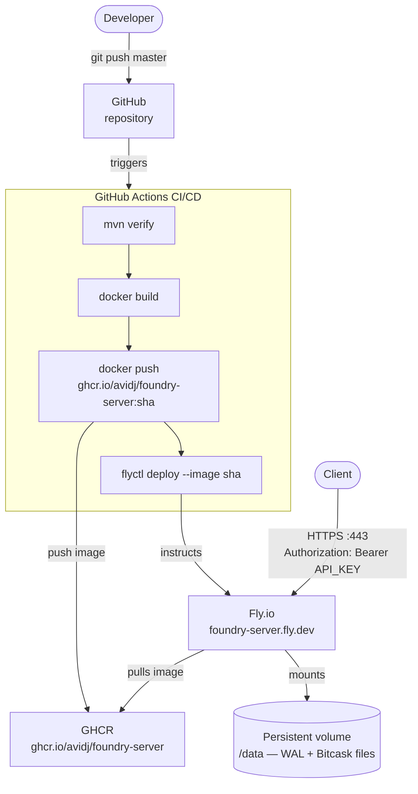

# foundry-server Deployment

## Overview

foundry-server is a containerized HTTP key-value store backed by the Bitcask engine.
It runs on [Fly.io](https://fly.io) (Frankfurt) with a persistent volume for WAL data,
deployed automatically via GitHub Actions on every push to `master`.

## Architecture



## Components

| Component | Role |
|---|---|
| **GitHub repo** | Source of truth; push to `master` triggers the pipeline |
| **GitHub Actions** | Builds, tests, packages, and deploys on every push |
| **GHCR** | Stores Docker images tagged by git sha and `latest` |
| **Fly.io** | Runs the container; terminates TLS; auto-starts on request |
| **Persistent volume** | 1 GB Fly volume mounted at `/data`; survives deploys and container deletion |

## API

All endpoints except `/v1/health` require `Authorization: Bearer <API_KEY>`.

| Method | Path | Description |
|---|---|---|
| `GET` | `/v1/health` | Health check (no auth) |
| `GET` | `/v1/keys/{key}` | Read a value |
| `PUT` | `/v1/keys/{key}` | Write a value (body = raw string) |
| `DELETE` | `/v1/keys/{key}` | Delete a key |
| `POST` | `/v1/compact` | Trigger log compaction |

## Data Persistence

The `.bal` and `.bitcask` files are written to `/data` inside the container, which is backed
by a Fly.io persistent volume — a separate disk managed independently of the container.
On each deploy, the new container gets the same volume re-attached, so data survives across
deployments and container restarts. The volume is only destroyed explicitly with `flyctl volumes destroy`.

```bash
# Inspect the volume
flyctl volumes list --app foundry-server
```

## Verification

```bash
# Health check (no auth)
curl https://foundry-server.fly.dev/v1/health

# Write a value (use $'...' for ANSI-C quoting to embed a real newline)
curl -X PUT https://foundry-server.fly.dev/v1/keys/hello \
  -H "Authorization: Bearer $API_KEY" \
  --data-binary $'world\n'

# Read it back (-w "\n" adds a newline after the response for readability)
curl https://foundry-server.fly.dev/v1/keys/hello \
  -H "Authorization: Bearer $API_KEY" \
  -w "\n"

# Delete it
curl -X DELETE https://foundry-server.fly.dev/v1/keys/hello \
  -H "Authorization: Bearer $API_KEY"
```

## One-time Setup

```bash
# 1. Create Fly app
flyctl launch --name foundry-server --region fra --no-deploy

# 2. Create persistent volume
flyctl volumes create foundry_data --size 1 --region fra --app foundry-server

# 3. Set secrets (save the API_KEY value — needed to call the API)
API_KEY=$(openssl rand -hex 32) && echo $API_KEY
flyctl secrets set API_KEY=$API_KEY --app foundry-server

# 4. Add deploy token to GitHub repo secrets as FLY_API_TOKEN
flyctl tokens create deploy -x 999999h
```
